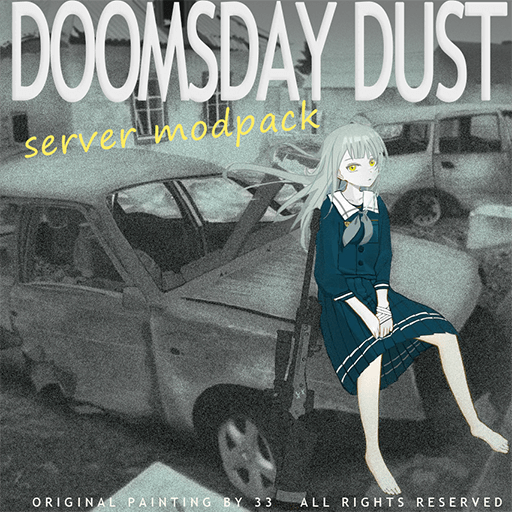

# 末日余烬服务器

  
  
末日余烬更新公告都将发布在这里,请多多关注哦

  
  
  
  

  
  
如果觉得服务器做的不错,可以赞助此项目,这对我帮助很大

  
请务必通过付款备注的方式留下你的游戏内ID,以便获取独家的赞助收藏品~

## ✨ 特性

- 🚀 特性1 - 简短描述
- 💡 特性2 - 简短描述
- 🎯 特性3 - 简短描述

## 📦 安装

\`\`\`bash
npm install your-package
\`\`\`

## 🚀 快速开始

\`\`\`javascript
// 简单示例代码
const example = require('your-package')
\`\`\`

## 📖 文档

详细文档请查看 [Wiki](链接)

## 🤝 贡献

欢迎提交 Issue 和 Pull Request

## 📄 许可

MIT License
